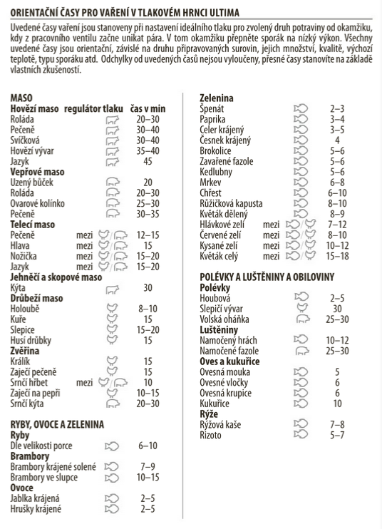

# Papiňák

## Krkovice na hořčici s rajčaty

- 1kg krkovice bez kosti
- 15g soli
- pepř
- olej
- plechovka rajčat
- velkou cibuli na půlkolečka
- plechovku hovězího vývaru
- půl plechovky červeného vína
- půl plechovky krémžské hořčice
- 8 stroučků česneku
- lžíce medu
- tymián
- dvě lžíce kukuřičného škrobu smíchaného s vodou na zahuštění

> Krkovici nakrájet na velké kousky, smíchat se solí a pepřem a nechat odstát.
>
> V papiňáku rozpálit olej a osmažit maso až trošku zezlátne. Poté přidat ostatní suroviny kromě škrobu.
>
> Papiňák utěsnit a vařit 23 min od vytvoření tlaku. Před odpouštním páry chvíli počkat a až poté páru odpustit
>
> Sundat víko, přidat škrob a omáčku lehce zredukovat. 